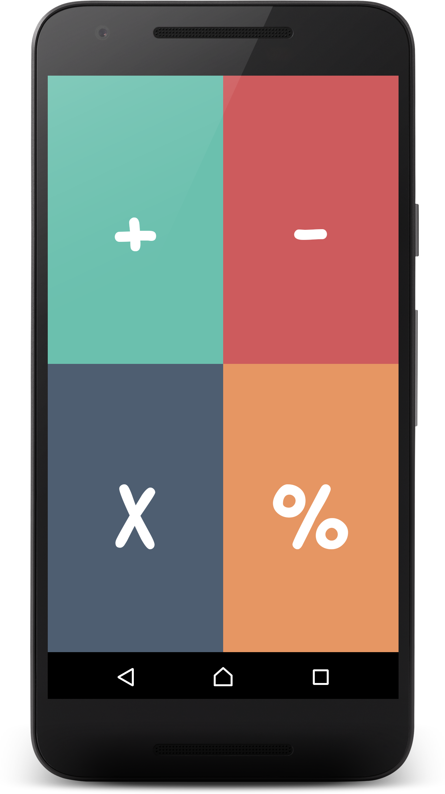
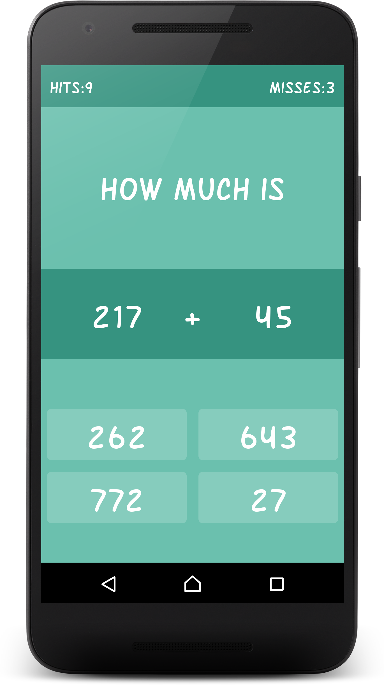
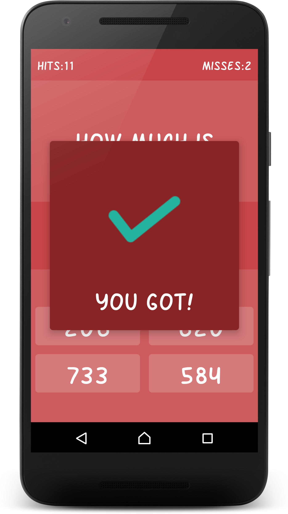
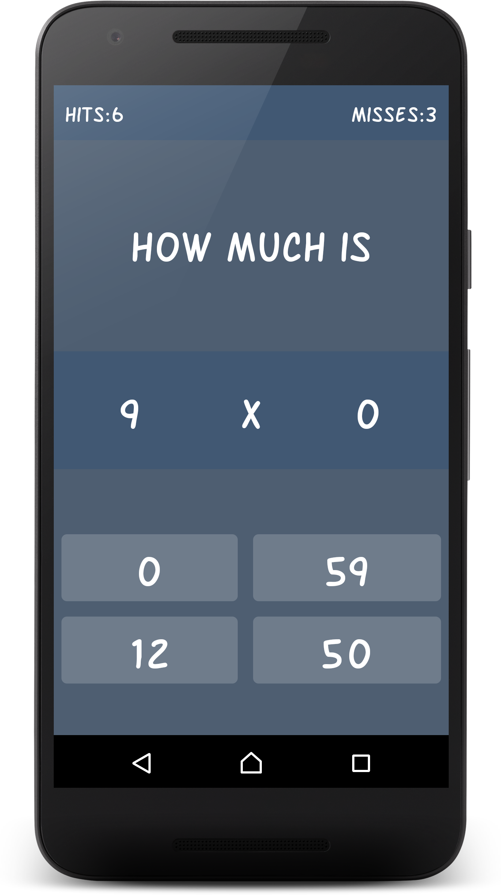
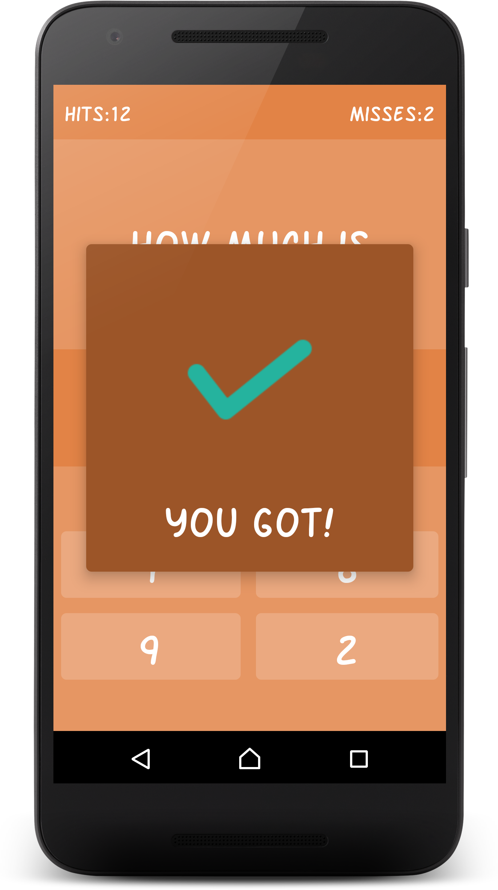

# Kids Math

Kids Math is a game that will teach Addition, Subtraction, Multiplication and Division to your son or daughter.

This game is recommended for kids between 5 and 10 years old that are learning Math at school.

With a ranking of hits and misses you can follow and give feedback about your kids learning.

**Screenshots:**

